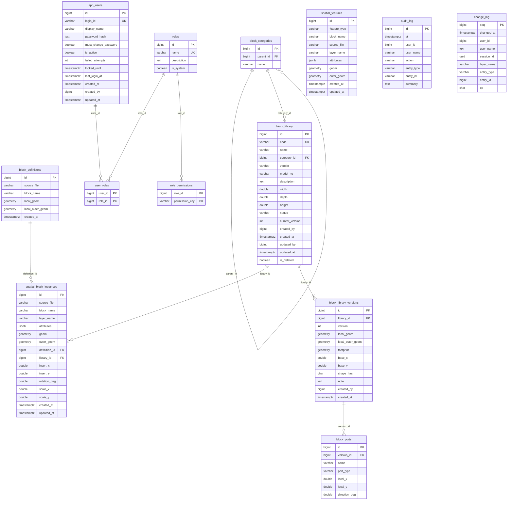

# 서버 데이터베이스 테이블 정의서와 ERD

기준일: 2026-10-08 / DBMS: PostgreSQL + PostGIS / 좌표계: EPSG:5186(SRID 5186, 단위 m)

모든 테이블은 앱 시작 시(또는 해당 기능을 처음 쓸 때) `EnsureSchema`가 멱등 SQL(`CREATE TABLE IF NOT EXISTS`, `ADD COLUMN IF NOT EXISTS`)로 만든다.
수동으로 실행하는 마이그레이션 스크립트는 없다. 정의의 원본 코드는 아래 표의 "정의 위치"에 있다.

| 영역 | 테이블 | 정의 위치 |
|---|---|---|
| 도면 데이터 | `spatial_features`, `spatial_block_instances`, `block_definitions` | `PostGisFeatureRepository.EnsureSchemaAsync` |
| 블록 라이브러리 | `block_categories`, `block_library`, `block_library_versions`, `block_ports` | `LibraryRepository.EnsureSchemaAsync` |
| 사용자·권한 | `app_users`, `roles`, `role_permissions`, `user_roles`, `audit_log` | `UserRepository.EnsureSchemaAsync` |
| 동기화 | `change_log` | `ChangeFeedRepository.EnsureSchemaAsync` |

## 1. ERD

PostgreSQL 외래 키(FK)로 연결된 관계는 실선, 외래 키는 없지만 값으로 연결되는 논리 관계는 3절에 따로 적었다.
GitHub와 Mermaid를 지원하는 뷰어에서 그림으로 보인다.

## 2. 테이블 정의서

표기: PK 기본 키, FK 외래 키, UK 고유, NN NOT NULL. `GEOMETRY(Geometry, 5186)`은 PostGIS 일반 도형 컬럼(SRID 5186)이다.

### 2.1 도면 데이터

#### `spatial_features` — 레이어·CAD 객체

DXF의 레이어 단위 집계 형상과 그 밖의 일반 공간 객체. 블록 인스턴스가 있는 레이어(예: Equipment)는 화면에서 `spatial_block_instances`가 우선한다.

| 컬럼 | 타입 | 제약 | 설명 |
|---|---|---|---|
| id | BIGINT | PK, 자동 증가 | 객체 ID |
| feature_type | VARCHAR(32) | NN | 종류. Import가 쓰는 값은 `cad_block`(CAD 블록 외곽 행), `dxf_layer`(레이어 집계 형상). 앱에서 직접 추가한 객체는 다른 값을 가질 수 있다 |
| block_name | VARCHAR(255) | | 블록 이름(레이어 행은 레이어 이름과 같을 수 있음) |
| source_file | VARCHAR(1024) | | Import한 DXF 파일 경로. `Del DXF`가 이 값으로 삭제 대상을 정한다 |
| layer_name | VARCHAR(255) | | CAD 레이어 이름 |
| attributes | JSONB | NN, 기본 `{}` | 속성 목록(문자열 키·값) |
| geom | GEOMETRY(Geometry, 5186) | NN | 실제 형상(보통 `GeometryCollection`) |
| outer_geom | GEOMETRY(Geometry, 5186) | | 외곽 영역(Polygon 또는 MultiPolygon) |
| created_at | TIMESTAMPTZ | NN, 기본 현재 | 생성 시각 |
| updated_at | TIMESTAMPTZ | NN, 기본 현재 | 수정 시각. 저장 시 낙관적 동시성 비교에 쓴다 |

인덱스: `idx_spatial_features_geom`(GIST geom), `idx_spatial_features_outer_geom`(GIST outer_geom), `idx_spatial_features_attributes`(GIN attributes).

#### `spatial_block_instances` — 배치된 블록 인스턴스

DXF `INSERT` 1개 = 1행. 한 행이 블록 전체(구성 선분 전부)를 하나의 객체로 나타낸다.

| 컬럼 | 타입 | 제약 | 설명 |
|---|---|---|---|
| id | BIGINT | PK, 자동 증가 | 인스턴스 ID |
| source_file | VARCHAR(1024) | NN | Import한 DXF 파일 경로 |
| block_name | VARCHAR(255) | NN | 블록 이름 |
| layer_name | VARCHAR(255) | | 배치된 레이어 |
| attributes | JSONB | NN, 기본 `{}` | 속성. 배치 값 `block_insert_x`, `block_insert_y`, `block_rotation_deg`, `block_scale_x`, `block_scale_y`, `block_name` 등 |
| geom | GEOMETRY(Geometry, 5186) | NN | 월드 좌표의 실제 형상(구성 객체 전체). 이동·회전하면 갱신 |
| outer_geom | GEOMETRY(Geometry, 5186) | NN | 월드 좌표의 외곽 영역. 장비 겹침 검사와 편집 윤곽에 쓴다 |
| definition_id | BIGINT | FK → `block_definitions.id` | 형상 정의 |
| library_id | BIGINT | FK → `block_library.id` | 라이브러리 항목(없으면 NULL = 연결 안 됨) |
| insert_x, insert_y | DOUBLE PRECISION | | 삽입점. 속성 JSON에서 변환 컬럼으로 동기화 |
| rotation_deg | DOUBLE PRECISION | | 회전(도) |
| scale_x, scale_y | DOUBLE PRECISION | | 축척 |
| created_at | TIMESTAMPTZ | NN, 기본 현재 | 생성 시각 |
| updated_at | TIMESTAMPTZ | NN, 기본 현재 | 수정 시각(낙관적 동시성) |

인덱스: `idx_spatial_block_instances_geom`, `..._outer_geom`(GIST), `..._layer`(layer_name), `..._definition`(definition_id), `..._library`(library_id).

#### `block_definitions` — 블록 형상 정의(로컬 좌표)

(source_file, block_name)마다 1행. 삽입점을 원점으로 한 블록 자신의 좌표계 형상이다. 인스턴스 변환의 역변환으로 계산하며(편집된 적 없는 인스턴스 우선) 동기화 SQL이 자동으로 채운다.

| 컬럼 | 타입 | 제약 | 설명 |
|---|---|---|---|
| id | BIGINT | PK, 자동 증가 | 정의 ID |
| source_file | VARCHAR(1024) | NN, UK(source_file, block_name) | DXF 파일 경로 |
| block_name | VARCHAR(255) | NN, 위와 함께 UK | 블록 이름 |
| local_geom | GEOMETRY(Geometry, 5186) | NN | 로컬 좌표 실제 형상 |
| local_outer_geom | GEOMETRY(Geometry, 5186) | | 로컬 좌표 외곽 |
| created_at | TIMESTAMPTZ | NN, 기본 현재 | 생성 시각 |

### 2.2 블록 라이브러리

#### `block_categories` — 분류 트리

| 컬럼 | 타입 | 제약 | 설명 |
|---|---|---|---|
| id | BIGINT | PK, 자동 증가 | 분류 ID |
| parent_id | BIGINT | FK → `block_categories.id` | 상위 분류(최상위는 NULL) |
| name | VARCHAR(255) | NN | 분류 이름. 같은 상위 안에서 고유(`ux_block_categories_name`: `COALESCE(parent_id,0), name`) |

최초에 `미분류` 1행이 만들어지고, 이후 이름을 바꿀 수 있다. 분류가 하나도 없을 때만 기본 분류를 만든다. 새 블록은 가장 먼저 만든 최상위 분류에 들어간다.

#### `block_library` — 라이브러리 항목

| 컬럼 | 타입 | 제약 | 설명 |
|---|---|---|---|
| id | BIGINT | PK, 자동 증가 | 항목 ID |
| code | VARCHAR(255) | NN, UK | 항목 코드(자동 등록은 블록 이름) |
| name | VARCHAR(255) | NN | 표시 이름 |
| category_id | BIGINT | FK → `block_categories.id` | 분류 |
| vendor, model_no | VARCHAR(255) | | 제조사, 모델 번호 |
| description | TEXT | | 설명 |
| width, depth, height | DOUBLE PRECISION | | 규격(m). 폭·깊이는 외곽에서 계산 |
| status | VARCHAR(20) | NN, 기본 `released` | `draft` / `released` / `deprecated` |
| current_version | INTEGER | NN, 기본 1 | 현재 버전 번호 |
| created_by, updated_by | BIGINT | | 작성·수정 사용자 ID(FK 없음) |
| created_at, updated_at | TIMESTAMPTZ | NN, 기본 현재 | 생성·수정 시각 |
| is_deleted | BOOLEAN | NN, 기본 FALSE | 논리 삭제(사용 중인 항목은 삭제할 수 없음) |

#### `block_library_versions` — 항목 버전별 형상

| 컬럼 | 타입 | 제약 | 설명 |
|---|---|---|---|
| id | BIGINT | PK, 자동 증가 | 버전 행 ID |
| library_id | BIGINT | NN, FK → `block_library.id`, UK(library_id, version) | 항목 |
| version | INTEGER | NN | 버전 번호(현재는 항목마다 1) |
| local_geom | GEOMETRY(Geometry, 5186) | NN | 로컬 좌표 형상 |
| local_outer_geom | GEOMETRY(Geometry, 5186) | | 로컬 외곽 |
| footprint | GEOMETRY(Geometry, 5186) | | 점유 영역(미사용, 후속 단계) |
| base_x, base_y | DOUBLE PRECISION | NN, 기본 0 | 기준점 |
| shape_hash | CHAR(32) | NN | 형상 해시(`md5(ST_AsText(ST_SnapToGrid(geom, 0.001)))`). 중복 등록 감지용 |
| note | TEXT | | 버전 메모 |
| created_by | BIGINT | | 작성 사용자 ID |
| created_at | TIMESTAMPTZ | NN, 기본 현재 | 생성 시각 |

인덱스: `idx_block_library_versions_hash`(shape_hash).

#### `block_ports` — 연결점(테이블만 있고 화면은 아직 없음)

| 컬럼 | 타입 | 제약 | 설명 |
|---|---|---|---|
| id | BIGINT | PK, 자동 증가 | 연결점 ID |
| version_id | BIGINT | NN, FK → `block_library_versions.id` (ON DELETE CASCADE) | 버전 |
| name | VARCHAR(255) | NN | 이름 |
| port_type | VARCHAR(100) | | 종류 |
| local_x, local_y | DOUBLE PRECISION | NN | 로컬 좌표 |
| direction_deg | DOUBLE PRECISION | | 방향(도) |

### 2.3 사용자·권한

#### `app_users` — 앱 사용자

| 컬럼 | 타입 | 제약 | 설명 |
|---|---|---|---|
| id | BIGINT | PK, 자동 증가 | 사용자 ID |
| login_id | VARCHAR(64) | NN, 고유(`lower(login_id)`) | 로그인 ID(대소문자 무시) |
| display_name | VARCHAR(128) | NN | 표시 이름 |
| password_hash | TEXT | NN | `PBKDF2-SHA256$반복횟수$솔트$해시` 문자열 |
| must_change_password | BOOLEAN | NN, 기본 FALSE | 다음 로그인 때 비밀번호 변경 강제 |
| is_active | BOOLEAN | NN, 기본 TRUE | 활성 여부(삭제 대신 비활성화) |
| failed_attempts | INT | NN, 기본 0 | 연속 실패 횟수(5회에서 잠금) |
| locked_until | TIMESTAMPTZ | | 잠금 해제 시각(15분) |
| last_login_at | TIMESTAMPTZ | | 마지막 로그인 |
| created_at | TIMESTAMPTZ | NN, 기본 현재 | 생성 시각 |
| created_by | BIGINT | | 생성한 사용자 ID |
| updated_at | TIMESTAMPTZ | NN, 기본 현재 | 수정 시각 |

#### `roles` — 역할

| 컬럼 | 타입 | 제약 | 설명 |
|---|---|---|---|
| id | BIGINT | PK, 자동 증가 | 역할 ID |
| name | VARCHAR(64) | NN, UK | 역할 이름 |
| description | TEXT | | 설명 |
| is_system | BOOLEAN | NN, 기본 FALSE | 기본 제공 역할 여부(삭제 불가) |

기본 역할: `Admin`, `LibraryManager`, `Designer`, `Viewer`. 처음 한 번만 만들어지고 이후 관리자가 바꾼 권한은 유지된다.

#### `role_permissions` — 역할별 권한

| 컬럼 | 타입 | 제약 | 설명 |
|---|---|---|---|
| role_id | BIGINT | PK, FK → `roles.id` (ON DELETE CASCADE) | 역할 |
| permission_key | VARCHAR(64) | PK | 권한 키: `user.manage`, `library.view/create/edit/delete/publish`, `drawing.view/edit/delete/export`, `import.dxf`, `audit.view` |

#### `user_roles` — 사용자·역할 연결

| 컬럼 | 타입 | 제약 | 설명 |
|---|---|---|---|
| user_id | BIGINT | PK, FK → `app_users.id` (ON DELETE CASCADE) | 사용자 |
| role_id | BIGINT | PK, FK → `roles.id` | 역할(사용 중인 역할은 지울 수 없음) |

#### `audit_log` — 감사 로그

외래 키가 없고 사용자 이름을 복사해 저장하므로 사용자를 삭제해도 이력이 남는다.

| 컬럼 | 타입 | 제약 | 설명 |
|---|---|---|---|
| id | BIGINT | PK, 자동 증가 | 로그 ID |
| at | TIMESTAMPTZ | NN, 기본 현재 | 발생 시각 |
| user_id | BIGINT | | 사용자 ID |
| user_name | VARCHAR(128) | | 사용자 이름(복사본) |
| action | VARCHAR(64) | NN | 동작: `login`, `login.failed`, `logout`, `user.create/update/delete/password-reset/unlock`, `role.create/update/delete`, `drawing.save`, `dxf.import`, `dxf.delete`, `library.register`, `library.link`, `library.edit`, `library.delete`, `library.category.add`, `library.category.rename` 등 |
| entity_type | VARCHAR(64) | | 대상 종류 |
| entity_id | VARCHAR(128) | | 대상 ID(문자열) |
| summary | TEXT | | 요약 |

인덱스: `idx_audit_log_at`(at DESC).

### 2.4 동기화

#### `change_log` — 저장 변경 기록

다른 사용자에게 "서버 데이터가 변경되었습니다"를 알리는 근거. 저장·Import·`Del DXF`가 같은 트랜잭션에서 한 행씩 기록하고 `NOTIFY drawing_changed`를 보낸다. 30일 지난 행은 앱 시작 때 삭제한다.

| 컬럼 | 타입 | 제약 | 설명 |
|---|---|---|---|
| seq | BIGINT | PK, 자동 증가 | 변경 번호(앱이 "마지막으로 본 번호"로 비교) |
| changed_at | TIMESTAMPTZ | NN, 기본 현재 | 변경 시각 |
| user_id | BIGINT | | 저장한 사용자 ID |
| user_name | TEXT | | 저장한 사용자 이름(복사본) |
| session_id | UUID | | 저장한 앱 실행 단위. 자기 자신의 변경을 무시하는 데 쓴다 |
| layer_name | VARCHAR(255) | NN | 변경된 레이어(레이어가 없으면 `(no layer)`) |
| entity_type | VARCHAR(30) | NN | `block_instance`, `feature`, `import` |
| entity_id | BIGINT | | 객체 ID. 레이어 전체(Import·삭제)는 NULL |
| op | CHAR(1) | NN | `I` 추가 / `U` 수정 / `D` 삭제 |

인덱스: `idx_change_log_layer_seq`(layer_name, seq), `idx_change_log_changed_at`(changed_at).

## 3. 논리 관계 (외래 키 없음)

| 관계 | 설명 |
|---|---|
| `spatial_features.layer_name` ↔ `spatial_block_instances.layer_name` | 같은 CAD 레이어 이름. 레이어 목록은 두 테이블에서 합쳐 만든다 |
| `spatial_block_instances.(source_file, block_name)` ↔ `block_definitions.(source_file, block_name)` | 정의와 인스턴스의 원래 연결. `definition_id`로 굳어진다 |
| `block_library.created_by/updated_by`, `block_library_versions.created_by` ↔ `app_users.id` | 작성자·수정자(FK 없음) |
| `audit_log.user_id`, `change_log.user_id` ↔ `app_users.id` | 이력 보존을 위해 FK를 두지 않고 이름을 복사해 저장 |
| `change_log.(layer_name, entity_id)` ↔ `spatial_block_instances.id` / `spatial_features.id` | `entity_type`으로 대상 테이블이 정해진다. 삭제된 객체도 기록은 남는다 |

## 4. 삭제·정리 규칙 요약

- `Del DXF`: 해당 `source_file`의 `spatial_features`(`cad_block`, `dxf_layer`), `spatial_block_instances`, `block_definitions`를 삭제한다. 라이브러리 항목과 버전은 남고, 같은 DXF를 다시 가져오면 형상이 같은 항목에 다시 연결된다.
- 라이브러리 항목은 논리 삭제(`is_deleted`)만 하며, 인스턴스가 연결된 항목은 삭제할 수 없고 `deprecated`로 바꾼다.
- 사용자는 비활성화(`is_active = FALSE`)가 기본이다. 역할은 사용 중이면 삭제할 수 없다.
- `change_log`는 30일이 지난 행을 앱 시작 때 지운다. `audit_log`는 자동 삭제하지 않는다.

## 5. 한계와 참고

- **정의 원본은 코드**다. 이 문서는 2026-10-08 기준 코드와 임시 DB 실행 결과를 바탕으로 썼고, 실제 `SD_DB`에서 `\d`로 대조하지는 않았다. 스키마를 바꾸면 이 문서도 함께 고쳐야 한다.
- `database/001_initial_schema.sql`은 초기 참고용이며 위 전체 구조를 담고 있지 않다. 실제 구조의 기준은 `EnsureSchema`다.
- 모든 사용자가 같은 PostgreSQL 계정으로 접속하고 권한은 앱에서 검사한다(`LIBRARY_DESIGN.md` 7.4).
